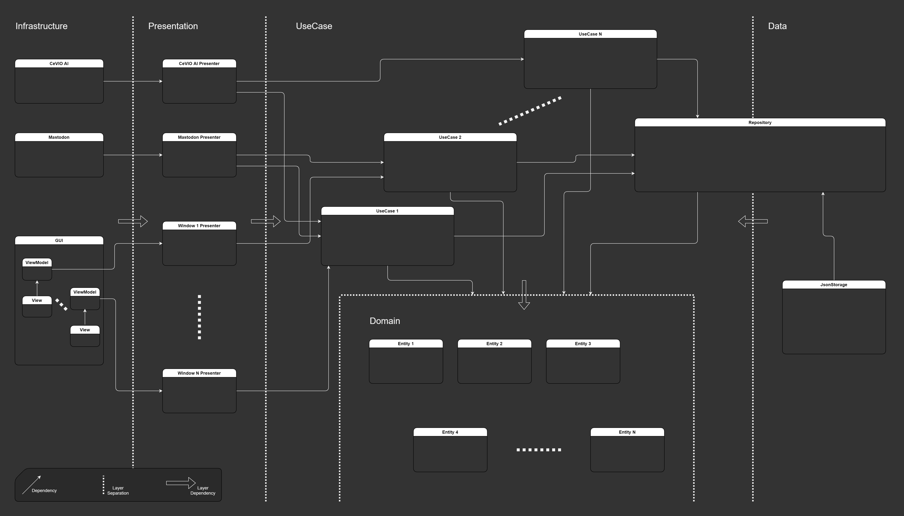

# アーキテクチャ

メインのプログラムはKoharuYomiageAppです。
MastodonやCeVIO AIなどは別サービスということで、別のライブラリとして作成しています。

## KoharuYomiageApp

クリーンアーキテクチャをベースに層を切って依存関係を一方通行にしています。

### Infrastructure層

この層は外部ライブラリおよびGUIのWPFを入れている層です。

### Presentation層

UseCase層とのつなぎ込みのための層です。

つなぎこむためのコードとして、Domain側に都合の良いデータを扱っているUseCase層から、外部サービスにとって都合の良いデータに変換することなどを行います。
例えば読み上げる文字列をHTMLタグを取り除いたりURLをリプレースしてから読み上げサービスに渡しています。

### Data層

設定データをJSONに書き出すための層です。

Repositoryだけは層をまたぐ存在として作成してあります。
Data層がJSONを書き出すだけで薄いことから、ここに層をしっかり切るのはコストがかかるだけで利点は少ないという判断からです。
これがORMなどでデータベース接続などが含まれて分厚くなる場合は層を切ったほうが良いでしょう。

### UseCase層

UseCase層です。
UseCaseごとにディレクトリを切ってnamespaceも切っています。

GUIの操作やタイムラインのアイテムの追加などの外部からの通知を受けて処理を起動することが多いです。
Domain層のアイテムをRepositoryから取得して加工してRepositoryに書きもどすのが基本です。

### Domain層

ピュアなロジック、あるいはデータなどを含む層です。

データについて、ものによってはReactiveなパラメータを公開して、UseCaseでの購読処理を楽にしているものがあります。
