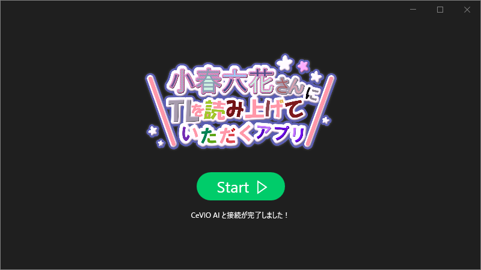
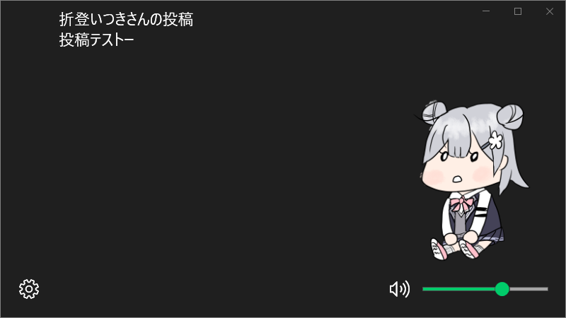

# 小春六花さんにTLを読み上げていただくアプリ

## Description

CeVIO AI 小春六花 トークボイスにSNSのTimelineを読み上げてもらうためのソフトウェアです。

v2.0.0 現在で対応しているSNSは次のとおりです。

- Mastodon
- Misskey

## Download

[Releases · MatchaChoco010/KoharuYomiage](https://github.com/MatchaChoco010/KoharuYomiage/releases)

Zipファイルをダウンロードして好きな場所に解凍すれば使えます。

## Update

解凍したディレクトリの中の`settings.json`をコピーすれば声質の設定を引き継げます。

## Features

- タイムラインの投稿・通知の読み上げ
- 複数アカウントのTLの読み上げ
- アカウントごと投稿種別ごとの声質パラメータ指定

## Requirement

このソフトウェアを動作させるためには以下のソフトウェアがインストールされたWindows 10が必要です。

- CeVIO AI 小春六花 トークボイス
- CeVIO AI トークエディタ

## Author

作者への連絡は次のアカウントから行えます。

[@MatchaChoco010Mk2@misskey.io](https://misskey.io/@MatchaChoco010Mk2)

## License

このソフトウェアはApache 2.0とMITのデュアルライセンスです。
